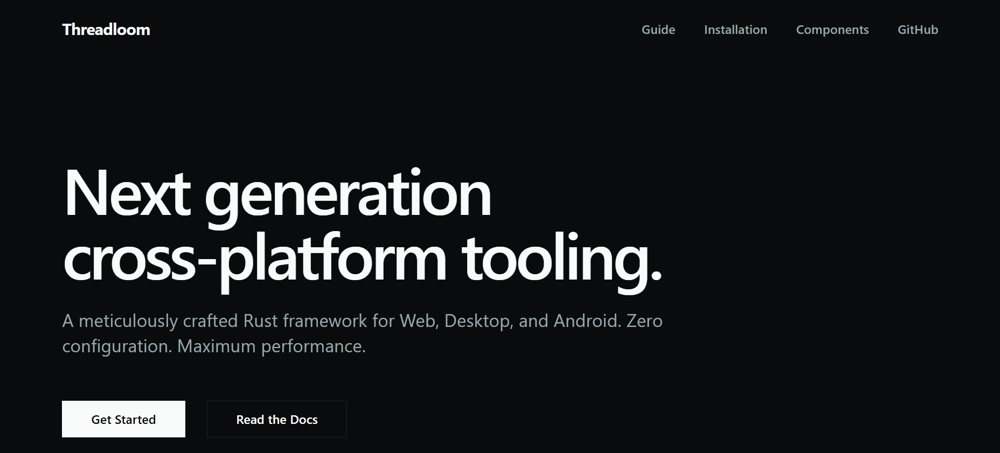

<p align="center">
  
</p>

<h1 align="center">Threadloom ⚡</h1>

<p align="center">
  <strong>Full-Stack Rust Framework for Web, Desktop & Android</strong>
</p>

<p align="center">
  <a href="https://github.com/Parth3930/threadloom/stargazers"></a>
  <a href="https://www.producthunt.com/products/threadloom/launches/threadloom"></a>
  <a href="./LICENSE"></a>
  <a href="https://www.rust-lang.org"></a>
  <a href="https://webassembly.org"></a>
</p>

<p align="center">
  <em>Threadloom lets you write your <strong>UI</strong>, your <strong>API</strong>, your <strong>desktop app</strong>, and your <strong>Android app</strong> entirely in Rust. No JavaScript. No TypeScript. No context-switching.</em>
</p>

<p align="center">
  <strong>⭐ Support the project:</strong> If you find Threadloom interesting, please consider starring it on GitHub!
</p>

---

## What is Threadloom?

Threadloom lets you write your **UI**, your **API**, your **desktop app**, and your **Android app** entirely in Rust. The frontend is written with a JSX-like `view!` macro and compiles to WebAssembly for the browser. The backend runs as a native binary on Actix Web, or ships serverlessly to Vercel with zero extra configuration.

The project is organized as a Cargo workspace of focused crates — core primitives, DOM rendering, the proc macro, the scheduler, the server abstraction, and native desktop/Android targets — plus a CLI (`distaff`) that ties it all together.

---

## Why Threadloom?

- ⚡ **Rust everywhere** — no JS/TS anywhere in your codebase
- 🕸️ **WASM-first web frontend** — compile your UI to WebAssembly for near-native browser performance
- 🖥️ **Native desktop target** — `threadloom-desktop` crate for shipping outside the browser
- 📱 **Native Android target** — `threadloom-android` crate for mobile
- 🔄 **Fine-grained reactivity** — signal-based state, no virtual DOM diffing overhead
- 🛠️ **`distaff` CLI** — hot reload, run, and production builds across web, desktop, and Android (a Vite-equivalent for Rust)
- 🚀 **One-command Vercel deployment** — `distaff build --vercel`, no config files needed
- 📦 **Modular workspace** — pull in only the crates you need
- 📊 **Benchmarked against Yew** — see [`benches/threadloom_vs_yew`](./benches/threadloom_vs_yew)

---

## Platforms

| Platform | Crate | Notes |
|---|---|---|
| 🌐 Web (WASM) | `threadloom-dom` | Primary, most mature target |
| ☁️ Serverless API | `threadloom-server` | One-command deploy to Vercel |
| 🖧 Native API | `threadloom-server` | Actix Web backend |
| 🖥️ Desktop | `threadloom-desktop` | Native desktop target |
| 📱 Android | `threadloom-android` | Native Android target |

Desktop and Android are newer, actively developed targets — expect the API surface to evolve faster there than on web.

---

## Quick Start

```bash
# Install the CLI
cargo install distaff

# Create a new project
distaff new my-app
cd my-app

# Run it (hot reload included)
distaff run              # web
distaff run --desktop    # desktop
distaff run --android    # android
```

---

## Example: A Reactive Counter in Rust

```rust
use threadloom::prelude::*;

#[component]
fn Counter() -> View {
    let count = signal(0);

    let increment = move |_| count.set(count.get() + 1);

    Column(gap=4, justify="center") {
        Container(class="counter") {
            Section { count }
            Button(onclick=increment) { "Click me" }
        }
    }
}
```

Fine-grained signals mean only the parts of the DOM that depend on `count` re-render — no virtual DOM, no wasted diffing.

There's a full working example in [`examples/whiteboard`](./examples/whiteboard).

### Built-in UI components (`threadloom-ui`)

Threadloom ships a small set of baked-in, Tailwind-styleable primitives so you're not writing raw markup for common layout needs:

- **`Container`** — a generic div for styling via Tailwind classes
- **`Row`** — horizontal flex layout (`gap`, `justify`, etc.)
- **`Column`** — vertical flex layout
- **`Section`** — semantic content grouping

All of them take the same call-style syntax — `Component(prop=value, ...) { children }` — and accept a `class` prop for Tailwind utility classes directly.

---

## Deploying

### Web → Vercel (serverless)

```bash
distaff build --vercel
vercel deploy
```

API routes are automatically wrapped in Vercel's serverless runtime — no manual configuration required.

### Web → Native Actix Web server

```bash
distaff build
./target/release/my-app
```

---

## Workspace / Crate Structure

| Crate | Purpose |
|---|---|
| [`threadloom`](./crates/threadloom) | Main re-export crate — start here |
| [`threadloom-core`](./crates/threadloom-core) | Shared types, signal primitives, HTTP client |
| [`threadloom-dom`](./crates/threadloom-dom) | WASM DOM diffing and rendering engine |
| [`threadloom-macro`](./crates/threadloom-macro) | `view!` proc macro for JSX-like templates |
| [`threadloom-ui`](./crates/threadloom-ui) | Built-in UI components |
| [`threadloom-scheduler`](./crates/threadloom-scheduler) | Async task scheduler |
| [`threadloom-server`](./crates/threadloom-server) | Server abstraction (Actix + Vercel runtime) |
| [`threadloom-desktop`](./crates/threadloom-desktop) | Native desktop target |
| [`threadloom-android`](./crates/threadloom-android) | Native Android target |
| [`distaff`](./crates/distaff) | CLI tool — new, dev, build, hot-reload |

---

## FAQ

**Does Threadloom require any JavaScript?**
No. The UI, state, routing, API, and native desktop/Android targets are all written in Rust.

**How is this different from Yew or Leptos?**
Threadloom bundles the frontend framework, dev tooling (`distaff`), server abstraction, and native desktop/Android targets into one cohesive workspace, rather than requiring you to assemble them separately. There's also a head-to-head benchmark against Yew in the repo.

**Is it production-ready?**
Threadloom is early-stage and under active development — the web/WASM target is the most mature; desktop and Android are newer. Expect rough edges, and contributions/bug reports are welcome.

---

## Contributing

PRs are welcome. For significant changes, please open an issue first to discuss what you'd like to change.

---

## License

[MIT](./LICENSE)
